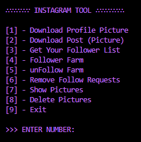

# Instagram Tool

Console based tool with useful features that can be used for Instagram.



# Installing Dependencies

## 1. Python Dependencies

```bash
pip install selenium colored pillow python-dotenv requests
```

or run the `dep-installer.py` file.

## 2. Chrome Driver

Current ChromeDriver version is 119. Please check [here](https://googlechromelabs.github.io/chrome-for-testing/) for the latest version.

ChromeDriver version must be the same chrome version installed on your system. You can check your installed chrome version via Settings > About Chrome.

#### Installation

1. Add latest ChromeDriver to in "driver" folder.
2. Set image and driver path.

# Additional Notes

## Removing pending follow requests

Order to remove pending follow requests:

1. Download your data from Instagram.
   - Your Activity > [Download Your Information](https://www.instagram.com/download/request)
   - Select JSON format and click "Next" button.
   - Enter your password and click "Request Download" button.
   - Wait for Instagram to send you your data with email.
   - Extract the zip file.
2. Find`pending_follow_requests.json` file under `followers_and_following` folder.
3. Copy the file to `data` folder in the tool.

#### ! Do not rename or edit the file.

## Fill login information

if you don't want to pass your login information every time you run the tool, please fill the `_loginInfo` file or create a `.env` file with the following variables:

```bash
USERNAME="your_username"
PASSWORD="your_password"
```

## Links to the repositories of the libraries used in this tool

- [Selenium](
    https://github.com/SeleniumHQ/Selenium) 
- [Colored](
    https://gitlab.com/dslackw/colored)
- [Pillow](
   https://github.com/python-pillow/Pillow
)
- [python-dotenv](
   https://github.com/theskumar/python-dotenv
)
- [Requests](
   https://github.com/psf/requests
)
